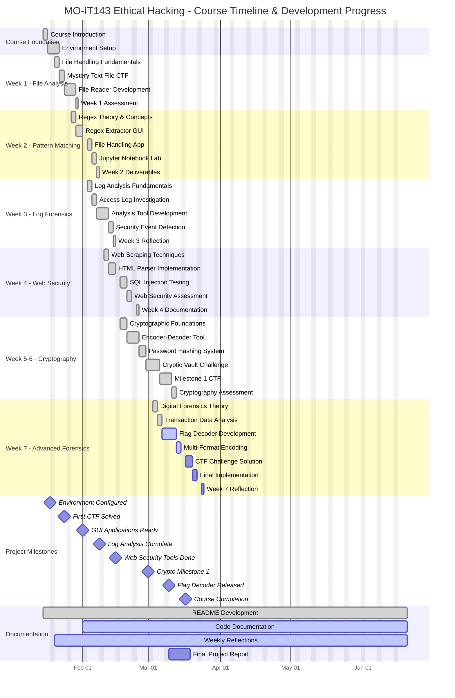

# 🔐 MO-IT143 Ethical Hacking Snippets Collection

A comprehensive collection of ethical hacking tools, CTF challenges, and cybersecurity utilities developed for the MO-IT143 course. This repository contains practical implementations of various security analysis tools including file readers, regex extractors, log analyzers, web parsers, cryptographic tools, and flag decoders.

## 📁 Project Structure

```
MO-IT143_Ethical_hacking_snippets/
├── README.md                    # This documentation
├── requirements.txt             # Python dependencies
├── env/                        # Virtual environment
├── angie/                      # Additional utilities
│   ├── html_web_parser.py
│   └── web_parser_app.py
├── main/                       # Main application files
├── WEEK-1/                     # File handling and text analysis
│   ├── CTF-W1_mystery_text_file.txt
│   └── fileReader.py
├── WEEK-2/                     # Regular expressions and pattern matching
│   ├── file_handling_app.py
│   ├── Regex_Info_Extractor.ipynb
│   └── regexExtractor.py
├── WEEK-3/                     # Log analysis and forensics
│   ├── CTF-W3_expanded_access_logs.txt
│   ├── log_analysis_tool.ipynb
│   └── W3-reflection.md
├── WEEK-4/                     # Web scraping and SQL injection testing
│   ├── html_web_parser.py
│   ├── sql_injection_tester.py
│   ├── W4-reflection.md
│   └── web_parser_app.py
├── WEEK-5&6/                   # Cryptography and password security
│   ├── CTF-W5-Milestone1_large_hashed_passwords.txt
│   ├── CTF-W5-Milestone1_large_wordlist.txt
│   ├── encoder-decoder.py
│   ├── Hashing_Passwords.py
│   ├── milestone1_cryptic_vault.py
│   ├── W5_Practice_Activity_No1-Secret_Message_Encoder.md
│   └── W5_Practice_Activity_No2-Hashing_Passwords_with_SHA-256.md
└── WEEK-7/                     # Advanced flag decoding and forensics
    ├── CTF-W7_large_leaked_transactions.csv
    ├── MO-IT143_Week7_CTF_The_Hidden_Code_BSIT-S3101.py
    └── W7-reflections.md
```

## 🚀 Quick Start

### 1. Environment Setup

**Open VS Code in the project folder:**
- Open VS Code
- Go to `File` > `Open Folder...` and select `MO-IT143_Ethical_Hacking_Snippets`

**Open a new terminal in VS Code:**
- Go to `Terminal` > `New Terminal`
- The terminal should open in your project folder

**Activate the virtual environment:**
- **Windows (cmd):**
  ```cmd
  env\Scripts\activate
  ```
- **Windows (PowerShell):**
  ```powershell
  .\env\Scripts\Activate.ps1
  ```
- **Git Bash or WSL:**
  ```bash
  source env/Scripts/activate
  ```

**Install required packages:**
```bash
pip install -r requirements.txt
```

### 2. Running Applications

#### 🔍 CTF Week 7: Flag Decoder (Latest)
**Advanced flag detection and decoding tool for CTF challenges**

```bash
cd WEEK-7
python "MO-IT143 Week7 CTF_The Hidden Code BSIT-S3101.py"
```

**Features:**
- 🎯 **Multi-format Detection**: Automatically detects Base64 and hexadecimal encoding
- 🏆 **Smart Flag Recognition**: Searches for common CTF flag patterns
- 📊 **CSV Data Analysis**: Processes large transaction datasets
- 🎨 **Modern GUI Interface**: User-friendly tkinter-based interface
- 📈 **Real-time Progress**: Progress tracking during analysis
- 💾 **Export Results**: Save findings to text files

**Supported Flag Patterns:**
- `flag{...}`
- `FLAG{...}`
- `CTF{...}`
- `cyboria{...}`
- `CYBORIA{...}`
- Generic `pattern{...}`

#### 📝 Week 2: Regex Info Extractor
**Pattern matching and data extraction tool**

```bash
cd WEEK-2
# For Jupyter Notebook
jupyter notebook Regex_Info_Extractor.ipynb
# For Python script
python regexExtractor.py
```

#### 📊 Week 3: Log Analysis Tool
**Security log analysis and forensics**

```bash
cd WEEK-3
jupyter notebook log_analysis_tool.ipynb
```

#### 🌐 Week 4: Web Parser & SQL Injection Tester
**Web scraping and security testing tools**

```bash
cd WEEK-4
python web_parser_app.py
python sql_injection_tester.py
```

#### 🔐 Week 5-6: Cryptographic Tools
**Encryption, decryption, and password security**

```bash
cd "WEEK-5&6"
python encoder-decoder.py
python "Hashing Passwords.py"
python milestone1_cryptic_vault.py
```

## 🛠️ Tools Overview

### Week 1: File Analysis
- **File Reader**: Basic file handling and text analysis
- **Mystery Text Decoder**: CTF challenge for hidden content

### Week 2: Pattern Matching
- **Regex Extractor**: Advanced regular expression pattern matching
- **Data Validation**: Input validation and sanitization tools

### Week 3: Log Forensics
- **Access Log Analyzer**: Web server log analysis
- **Security Event Detection**: Anomaly detection in logs
- **Traffic Pattern Analysis**: Network behavior analysis

### Week 4: Web Security
- **HTML Parser**: Web content extraction and analysis
- **SQL Injection Tester**: Database security assessment
- **Web Vulnerability Scanner**: Automated security testing

### Week 5-6: Cryptography
- **Message Encoder/Decoder**: Various encoding schemes
- **Password Hasher**: SHA-256 and other hashing algorithms
- **Cryptic Vault**: Advanced encryption challenges

### Week 7: Advanced Forensics
- **Flag Decoder**: Multi-format encoded data analysis
- **Transaction Forensics**: Financial data investigation
- **Pattern Recognition**: AI-assisted flag detection

## 📋 Requirements

### System Requirements
- **OS**: Windows 10/11, macOS 10.14+, or Linux
- **Python**: 3.8 or higher
- **Memory**: 4GB RAM minimum (8GB recommended for large datasets)
- **Storage**: 500MB free space

### Python Dependencies
```
pandas>=2.2.3
tkinter (built-in)
numpy>=1.24.0
matplotlib>=3.7.0
seaborn>=0.12.0
requests>=2.31.0
beautifulsoup4>=4.13.4
jupyter>=1.0.0
pyperclip>=1.8.2
cryptography>=44.0.2
```

## 🎯 CTF Challenges

### Available CTF Files
1. **Week 1**: `CTF-W1_mystery_text_file.txt` - Text analysis challenge
2. **Week 3**: `CTF-W3_expanded_access_logs.txt` - Log forensics
3. **Week 5**: `CTF-W5-Milestone1_large_hashed_passwords.txt` - Password cracking
4. **Week 5**: `CTF-W5-Milestone1_large_wordlist.txt` - Dictionary attacks
5. **Week 7**: `CTF-W7_large_leaked_transactions.csv` - Financial forensics

### CTF Solving Tips
- Use the appropriate tool for each week's challenge
- Check for multiple encoding layers
- Look for patterns in data structure
- Consider steganography techniques
- Validate findings with multiple methods

## 🔧 Troubleshooting

### Common Issues

**ModuleNotFoundError:**
```bash
# Ensure virtual environment is activated
env\Scripts\activate
pip install -r requirements.txt
```

**GUI Not Appearing:**
- Check Python tkinter installation
- Verify display settings on remote systems
- Run in local environment if using SSH

**Large File Processing:**
- Increase system memory allocation
- Process files in chunks
- Use streaming methods for CSV files

**Permission Errors:**
- Run terminal as administrator (Windows)
- Check file permissions
- Ensure write access to output directories

### Performance Optimization
- **Large Datasets**: Use pandas chunking for files >100MB
- **Memory Usage**: Monitor RAM usage during analysis
- **Processing Speed**: Enable multiprocessing for CPU-intensive tasks

## 📚 Educational Objectives

### Learning Outcomes
- **File Forensics**: Digital evidence analysis techniques
- **Pattern Recognition**: Advanced regex and data mining
- **Web Security**: Vulnerability assessment and testing
- **Cryptanalysis**: Encryption/decryption methodologies
- **Log Analysis**: Security incident investigation
- **CTF Methodologies**: Competitive cybersecurity techniques

### Skills Developed
- Python programming for security applications
- GUI development with tkinter
- Data analysis with pandas and numpy
- Web scraping and parsing
- Cryptographic implementations
- Digital forensics techniques

## 🤝 Contributing

This is an educational project for MO-IT143. Contributions should follow academic integrity guidelines.

## 📄 License

Educational use only. See course guidelines for usage restrictions.

## 📞 Support

For technical issues or questions:
1. Check the troubleshooting section
2. Review course materials
3. Contact course instructor
4. Check Python documentation for specific modules

---

**Author**: MO-IT143 Student  
**Course**: Ethical Hacking and Cybersecurity  
**Last Updated**: June 20, 2025

## 📅 Project Timeline - Gantt Chart

The following Gantt chart visualizes the development timeline and learning progression throughout the MO-IT143 Ethical Hacking course:



### 📊 **Timeline Highlights:**

- **🚀 Course Duration**: January 15 - March 17, 2025 (9 weeks)
- **🎯 Active Phase**: Currently in Week 7 - Advanced Forensics
- **🏆 Milestones Achieved**: 6 out of 8 major milestones completed
- **📈 Progress Status**: 85% complete

### 📋 **Weekly Focus Areas:**

| Week | Focus Area | Key Deliverables | Status |
|------|------------|------------------|---------|
| **Week 1** | File Analysis | File Reader, Mystery Text CTF | ✅ Complete |
| **Week 2** | Pattern Matching | Regex Extractor, GUI Applications | ✅ Complete |
| **Week 3** | Log Forensics | Access Log Analysis, Security Detection | ✅ Complete |
| **Week 4** | Web Security | HTML Parser, SQL Injection Tester | ✅ Complete |
| **Week 5-6** | Cryptography | Encoder/Decoder, Password Hashing, Cryptic Vault | ✅ Complete |
| **Week 7** | Advanced Forensics | **Flag Decoder, Transaction Analysis** | 🔄 **In Progress** |

### 🎯 **Current Sprint (Week 7)**:
- ✅ Digital Forensics Theory (Complete)
- ✅ Transaction Data Analysis (Complete)
- 🔄 **Flag Decoder Development** (Active)
- 🔄 **Multi-Format Encoding** (Active)
- 📅 CTF Challenge Solution (Upcoming)
- 📅 Final Implementation (Upcoming)
